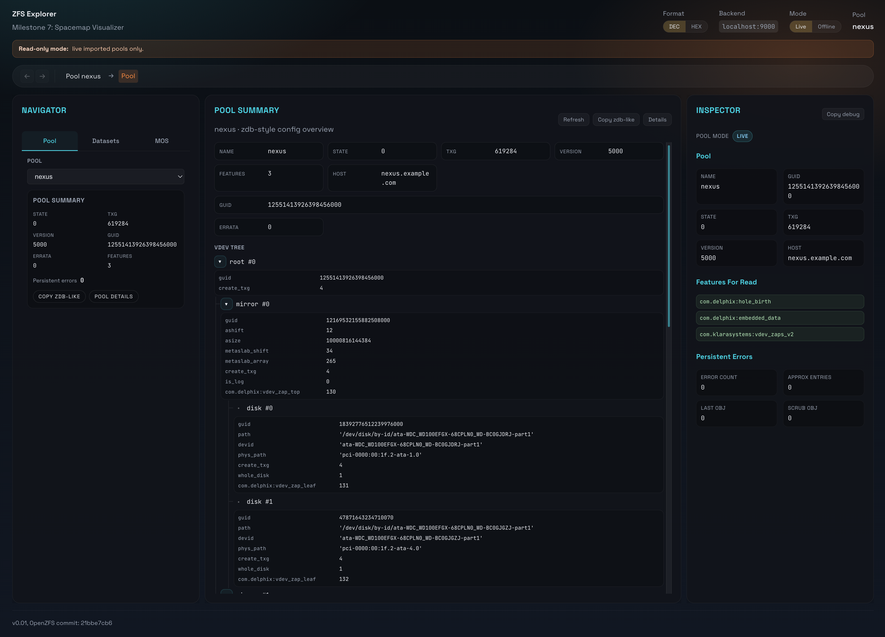
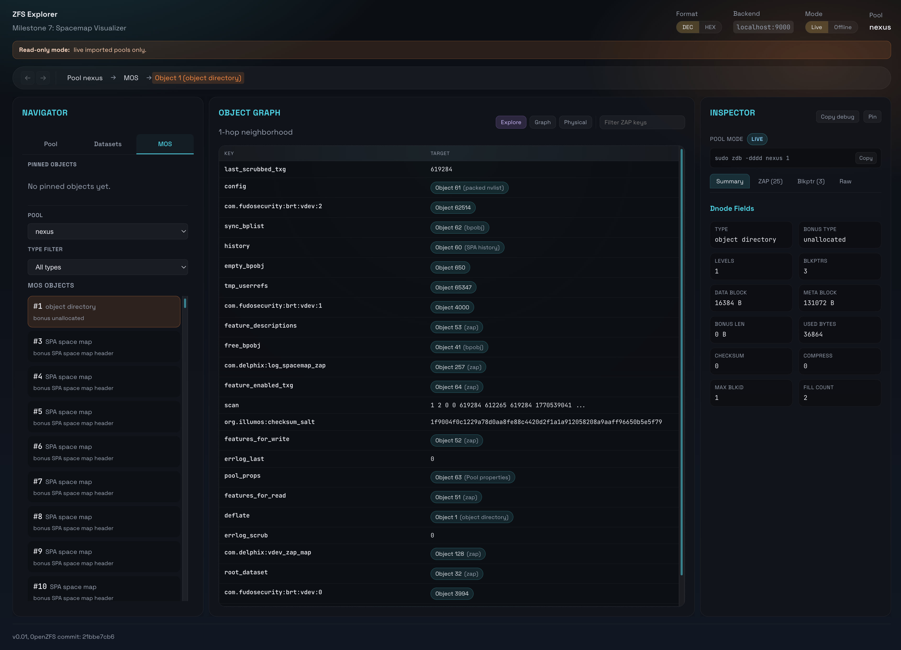
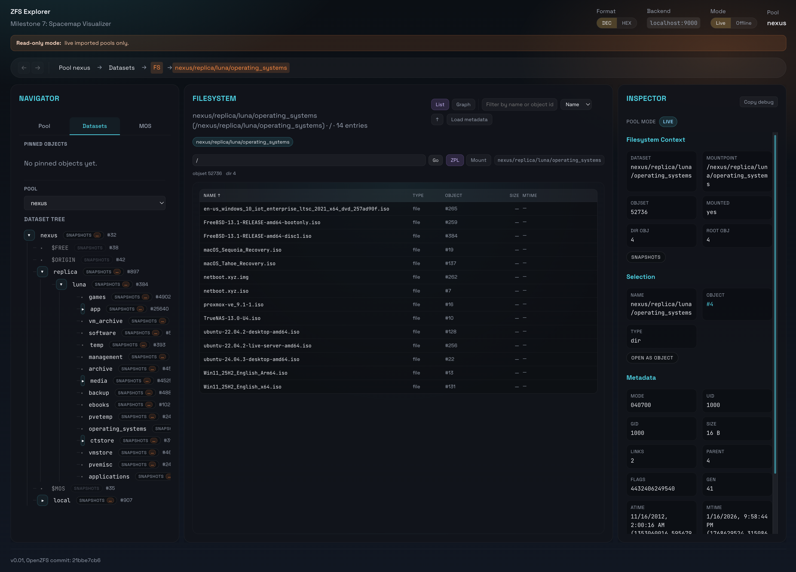
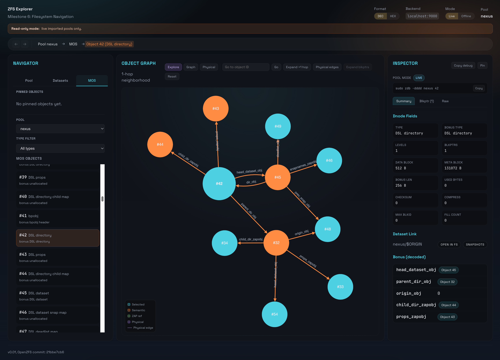
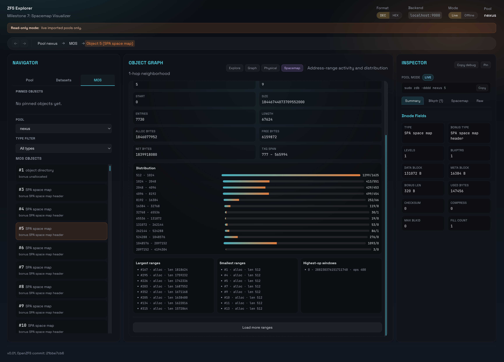

# ZFS Explorer

**ZFS Explorer** is a web-based, read-only explorer for ZFS on-disk structures —
a visual frontend for `zdb`.

It allows interactive inspection of ZFS internals while preserving full
object-level accuracy. The goal is not to abstract ZFS, but to make its on-disk
format explorable, navigable, and debuggable.

ZFS Explorer currently supports:

- Pool configuration summary (zdb-style fields + vdev tree)
- Persistent pool error-log browsing (paged, with optional path resolution)
- MOS object browsing and inspection
- Dnode and blkptr decoding
- ZAP visualization
- Dataset and DSL graph traversal
- ZPL filesystem walking (directories and files)
- Raw block hex inspection via DVAs

The design is intentionally **read-only**. Long-term goals include supporting
analysis of **unimported or damaged pools**, enabling forensic inspection and
file recovery without ever importing the pool.

Current mode disclaimer: default operation is **live imported pools only**.
Experimental offline/exported pool analysis can be enabled explicitly via env
configuration (see **Offline Mode (Experimental)** below).

You can think of this project as:

- **`zdb`, visualized**
- **A filesystem browser that never lies**
- **A teaching and debugging tool for ZFS internals**
- **A foundation for ZFS recovery and forensic workflows**

**Current Status:** Active development (Milestones 0-6 complete; Release Readiness + Offline Mode work in progress)

## Guided Tour

1. Start backend on the ZFS host (`sudo ./run-backend.sh` or `sudo ./target/debug/zfs-explorer`).
2. Open the UI and pick a pool from the left pane.
3. Use `Datasets` to choose a dataset, then browse its filesystem view.
4. Click `Open as object` (or object links in Inspector) to jump into MOS/object inspection.
5. Use `Explore`, `Graph`, and `Physical` center views to inspect semantic and blkptr relationships.
6. Use Inspector tabs (`Summary`, `ZAP`, `Blkptr`, `Raw`) for detailed decoding and hex reads.
7. Use `Copy debug` in Inspector when reporting bugs.

## Common Workflows

### Dataset -> Filesystem -> Object Inspection

1. Select dataset in `Datasets` tree.
2. Browse paths in FS view (`List` or `Graph`).
3. Select an entry and click `Open as object`.
4. Inspect bonus fields, ZAP links, blkptrs, and raw block hex.

### DSL Traversal Path

1. In MOS mode, open object `1` (object directory) and inspect ZAP entries.
2. Follow `root_dataset` to DSL dir objects.
3. Traverse `child_dir_zapobj` / `head_dataset_obj` edges.
4. Handoff into FS view from dataset-linked inspector actions.

## Screenshots

Screenshots were captured on a high-DPI display. The README shows scaled previews
for readability; click any image to open the full-resolution PNG.

### 1. Pool summary + vdev tree

<a href="docs/screenshots/01-pool-summary.png">
  
</a>

### 2. MOS ZAP map view

<a href="docs/screenshots/02-mos-zap-map.png">
  
</a>

### 3. Dataset tree + filesystem view

<a href="docs/screenshots/03-dataset-tree-fs.png">
  
</a>

### 4. DSL directory graph exploration

<a href="docs/screenshots/04-dsl-directory-graph.png">
  
</a>

### 5. Spacemap visualizer

<a href="docs/screenshots/05-spacemap.png">
  
</a>

## Architecture

```
React UI (port 8080) -> Rust API (port 9000) -> libzdbdecode.so -> ZFS Libraries
```

## What's Implemented (Milestones 0-6)

- ✅ Pool discovery/open for imported pools with read-only safety model
- ✅ MOS browser with pagination, filtering, semantic + physical graph views
- ✅ Rich inspector for dnode fields, ZAP, blkptrs, and raw hex block reads
- ✅ Pool summary view with feature list, collapsible vdev tree, and copyable zdb-like output
- ✅ DSL-aware traversal and dataset tree navigation
- ✅ Filesystem navigation (list + graph modes) with dataset/mount handoff
- ✅ SPA history-friendly UI navigation, breadcrumbs, and object pinning
- ✅ Packaging/build scripts and offline fixture + parity validation tooling

## Bootstrap (Fresh Host)

Use the platform bootstrap script first, then run the normal build.

Debian:

```bash
build/bootstrap-debian.sh
build/build.sh --bootstrap-openzfs
```

Ubuntu:

```bash
build/bootstrap-ubuntu.sh
build/build.sh --bootstrap-openzfs
```

FreeBSD:

```bash
build/bootstrap-freebsd.sh
env MAKE=gmake build/build.sh --bootstrap-openzfs
```

Notes:

- `build/build.sh` uses `gmake` automatically on FreeBSD (or `MAKE` if set).
- On Ubuntu, `zfsutils-linux` is required for corpus fixture create/test scripts.
- If UI build warns about Node version, upgrade to Node `>= 20.19` for Vite 7.

## Running on a Host with ZFS Access

If your UI runs in a container/VM without ZFS access, run the backend on a host
that can see `/dev/zfs`, then tunnel the ports.

### 1. Build on your dev machine

```bash
# Build native + backend
cd native
make clean && make
cd ../backend
cargo build
```

### 2. Copy to the ZFS host (optional)

```bash
# Adjust USER/HOST/PATH to your environment
rsync -av ./native ./_deps ./backend/target USER@HOST:/path/to/zfs-explorer/
```

### 3. Run the backend on the ZFS host

```bash
ssh USER@HOST
cd /path/to/zfs-explorer/backend
sudo ./target/debug/zfs-explorer
```

Expected output:
```
INFO zfs_explorer: Initializing ZFS library...
INFO zfs_explorer: ZFS Explorer starting (OpenZFS 21bbe7cb6)
INFO zfs_explorer: API server listening on 127.0.0.1:9000
```

### 4. Run the UI

```bash
cd ui
npm run dev
```

### 5. Tunnel ports (if UI and backend are on different hosts)

```bash
# From your local machine
ssh -L 8080:127.0.0.1:8080 -L 9000:127.0.0.1:9000 USER@HOST
# Open http://localhost:8080 in your browser
```

## Offline Mode (Experimental)

Backend startup now supports an explicit offline pool-open mode for exported
pools. This mode is opt-in and remains read-only.

Runtime switching is also available from the UI header (`Mode: Live | Offline`)
or directly via `GET/PUT /api/mode`.

```bash
export ZFS_EXPLORER_POOL_MODE=offline
export ZFS_EXPLORER_OFFLINE_POOLS="poolA,poolB"
export ZFS_EXPLORER_OFFLINE_PATHS="/dev/disk/by-id:/srv/offline-images"
sudo ./run-backend.sh
```

Environment variables:

- `ZFS_EXPLORER_POOL_MODE`: `live` (default) or `offline`
- `ZFS_EXPLORER_OFFLINE_POOLS`: comma-separated pool names exposed by `/api/pools` in offline mode
- `ZFS_EXPLORER_OFFLINE_PATHS`: colon-separated search paths used by offline open logic
- `ZFS_EXPLORER_ZPOOL_CACHEFILE`: optional override for pool cachefile path in live mode
  (useful on hosts that do not use `/etc/zfs/zpool.cache`, e.g. `/data/zfs/zpool.cache`)

Offline troubleshooting:

- API errors now return a structured envelope:
  - `code` (for example `EZFS_NOENT`, `ERRNO_13`)
  - `message`
  - optional `hint`
- Typical fixes:
  - `EZFS_NOENT`: pool metadata was not found in the configured search paths
  - `EZFS_PERM` / `ERRNO_13`: backend needs root/raw-device read access
  - `EZFS_ACTIVE_POOL`: export pool before opening in offline mode

Direct file recovery download (live or offline):

```bash
# Download by dataset path (or absolute mounted path), with attachment headers
curl -fL -o recovered.bin \
  "http://127.0.0.1:9000/api/pools/testpool/zpl/path/testpool/myds/path/file.bin"

# Resume a partial transfer via HTTP Range
curl -fL -C - -o recovered.bin \
  "http://127.0.0.1:9000/api/pools/testpool/zpl/path/testpool/myds/path/file.bin"

# Explicit single-range request
curl -fL \
  -H "Range: bytes=0-1048575" \
  "http://127.0.0.1:9000/api/pools/testpool/zpl/path/testpool/myds/path/file.bin" \
  -o chunk-0.bin
```

Optional parity check workflow (live vs offline responses):

```bash
# live backend on :9000, offline backend on :9001
LIVE_BASE_URL=http://127.0.0.1:9000 \
OFFLINE_BASE_URL=http://127.0.0.1:9001 \
build/check-offline-parity.sh <pool> 1 32 34
```

Create a local offline fixture pool and run offline smoke checks:

```bash
# create/export a small file-backed fixture pool
build/create-offline-fixture.sh --pool zdx_fixture --force

# run backend smoke checks against that fixture (root required)
sudo build/test-offline-fixture.sh \
  --pool zdx_fixture \
  --search-paths "$(pwd)/fixtures/offline/zdx_fixture"
```

Create and validate corpus fixtures (layout/profile matrix):

```bash
# generate exported corpus fixture
build/create-corpus-fixture.sh \
  --pool zdx_mirror_base \
  --layout mirror \
  --profile baseline \
  --force

# generate encrypted dataset fixture (no key material available offline)
build/create-corpus-fixture.sh \
  --pool zdx_enc_nokey \
  --layout single \
  --profile encryption-no-key \
  --force

# run smoke checks + file checksum validation from manifest
sudo build/test-corpus-fixture.sh \
  --manifest fixtures/corpus/vdevtype=mirror/features=baseline/zdx_mirror_base/manifest.json

# run the default minimal corpus subset (mirror + raidz1 + encryption-no-key)
sudo build/test-corpus-subset.sh --list
sudo build/test-corpus-subset.sh

# create the full layout/profile matrix (20 combinations)
build/create-corpus-matrix.sh --list
build/create-corpus-matrix.sh --force

# validate every discovered manifest in the selected matrix
sudo build/test-corpus-matrix.sh --list
sudo build/test-corpus-matrix.sh --keep-going
```

Quick API sanity checks (backend runs on `127.0.0.1:9000`):

```bash
curl -s http://127.0.0.1:9000/api/pools | jq
curl -s http://127.0.0.1:9000/api/pools/<pool>/summary | jq
```

Run a focused OpenZFS ZTS smoke set (non-root user with passwordless sudo):

```bash
# list default "corpus" smoke tests
build/run-zts-smoke.sh --list

# run corpus profile smoke checks using sparse file-vdevs
build/run-zts-smoke.sh --profile corpus

# continue after failures and include extra zfs-tests.sh args
build/run-zts-smoke.sh --profile extended --keep-going -- -v
```

## Project Structure

```
zfs-explorer/
├── zfs/                    # OpenZFS submodule (commit 21bbe7cb6)
├── _deps/openzfs/          # Built OpenZFS userland
├── native/                 # C wrapper (libzdbdecode)
│   ├── include/
│   │   └── zdbdecode.h    # Public API
│   ├── src/
│   │   ├── zdbdecode_internal.h
│   │   ├── zdx_core.c
│   │   ├── zdx_pool.c
│   │   ├── zdx_mos.c
│   │   ├── zdx_dsl.c
│   │   ├── zdx_objset.c
│   │   ├── zdx_catalog.c
│   │   ├── zdx_zap.c
│   │   ├── zdx_block.c
│   │   ├── json.c         # JSON helpers
│   │   └── json.h
│   ├── libzdbdecode.so    # Built library
│   └── Makefile
├── backend/                # Rust server
│   ├── Cargo.toml
│   ├── build.rs           # FFI bindings
│   └── src/
│       ├── main.rs        # Entry point
│       ├── ffi/           # Safe FFI wrappers
│       └── api/           # API handlers
└── ui/                     # React frontend
    ├── package.json
    └── src/
        ├── App.tsx        # Main component
        └── App.css
```

## API Endpoints (Selected)

- `GET /api/version` - Build/runtime/debug metadata (includes active pool-open mode)
- `GET /api/mode` - Current runtime pool-open mode (`live`/`offline`)
- `PUT /api/mode` - Switch runtime pool-open mode (`{ "mode": "live" | "offline" }`)
- `GET /api/pools` - List all imported pools (returns JSON array of strings)
- `GET /api/pools/:pool/summary` - Structured pool config summary (`pool`, `features_for_read`, `vdev_tree`, `uberblock`)
- `GET /api/pools/:pool/errors?cursor=&limit=&resolve_paths=` - Persistent pool error log entries
- `GET /api/pools/:pool/mos/objects?type=&start=&limit=` - List MOS objects
- `GET /api/pools/:pool/obj/:objid` - MOS dnode metadata
- `GET /api/pools/:pool/obj/:objid/blkptrs` - MOS block pointers
- `GET /api/pools/:pool/obj/:objid/zap` - ZAP entries
- `GET /api/pools/:pool/graph/from/:objid` - 1-hop graph slice
- `GET /api/pools/:pool/datasets/tree` - Dataset tree
- `GET /api/pools/:pool/dataset/:dsl_dir_obj/head` - Dataset -> objset
- `GET /api/pools/:pool/dataset/:dsl_dir_obj/snapshots` - Snapshot list for a DSL dir
- `GET /api/pools/:pool/snapshot/:dsobj/objset` - Snapshot dataset object -> objset
- `GET /api/pools/:pool/snapshot/:dsobj/lineage?max_prev=&max_next=` - Bounded snapshot lineage chain
- `GET /api/pools/:pool/objset/:objset_id/root` - ZPL root znode
- `GET /api/pools/:pool/objset/:objset_id/dir/:dir_obj/entries` - Directory entries
- `GET /api/pools/:pool/objset/:objset_id/walk?path=/a/b` - Path walk
- `GET /api/pools/:pool/objset/:objset_id/stat/:objid` - ZPL stat
- `GET /api/pools/:pool/zpl/path/<path>` - File download by ZPL path (supports single `Range` request)
- `GET /api/pools/:pool/block?vdev=&offset=&asize=` - Raw block hex dump

## Build from Scratch

### 0. Clone with submodules

`zfs/` is an OpenZFS git submodule and is required for native/backend builds.

```bash
# fresh clone
git clone --recurse-submodules https://github.com/<you>/zfs-explorer.git
cd zfs-explorer

# if you already cloned without submodules
git submodule update --init --recursive
```

If you switch OpenZFS branches/tags in `zfs/` (for example `zfs-2.4.0` vs
`master`), do a clean re-sync before rebuilding to avoid mixed generated files.

```bash
git submodule update --init --recursive --force
git -C zfs reset --hard
git -C zfs clean -fdx
git -C zfs sparse-checkout disable || true
```

### 1. Install prerequisites (Debian/Ubuntu)

Quick bootstrap (recommended on fresh Debian VMs):

```bash
./build/bootstrap-debian.sh
```

This installs apt dependencies, host OpenZFS runtime packages, and initializes
submodules. Then continue with `./build/build.sh --bootstrap-openzfs`.

Manual install:

```bash
sudo apt-get update
sudo apt-get install -y \
  git build-essential autoconf automake libtool pkg-config m4 gawk \
  libssl-dev libelf-dev libudev-dev libblkid-dev uuid-dev zlib1g-dev \
  libzstd-dev libtirpc-dev clang libclang-dev \
  python3 python3-pip python3-setuptools python3-cffi libffi-dev \
  nodejs npm curl jq
```

Install Rust (if `cargo` is missing):

```bash
curl https://sh.rustup.rs -sSf | sh
source "$HOME/.cargo/env"
```

Node 20+ is recommended for current Vite/TypeScript tooling.

Backend note: Rust `bindgen` requires `libclang` at build time. If you see
`Unable to find libclang`, ensure `clang` and `libclang-dev` are installed.

### 1.1 Install OpenZFS runtime packages on Debian (recommended: backports)

For live pool access (`/dev/zfs`) and CLI-backed telemetry (`zpool`, `zfs`),
install Debian OpenZFS packages from backports.

```bash
# enable backports (adjust if your host manages apt sources differently)
echo "deb http://deb.debian.org/debian $(. /etc/os-release; echo $VERSION_CODENAME)-backports main contrib" \
  | sudo tee /etc/apt/sources.list.d/backports.list

sudo apt-get update
sudo apt-get install -y -t "$( . /etc/os-release; echo $VERSION_CODENAME)-backports" \
  zfsutils-linux zfs-dkms zfs-zed

# optional test tooling
sudo apt-get install -y -t "$( . /etc/os-release; echo $VERSION_CODENAME)-backports" zfs-test

# optional: required for build/run-zts-smoke.sh (ZTS uses ksh tests)
sudo apt-get install -y ksh
```

Notes:
- This project builds against the vendored `zfs/` submodule, not distro
  OpenZFS headers/libs.
- Host OpenZFS packages are still needed to access imported pools in live mode.
- After `zfs-dkms` install/upgrade, a reboot or `modprobe zfs` may be required.
- Debian backports currently tracks OpenZFS 2.4.0. If you want strict
  parity testing against those host packages, you can temporarily check out
  `zfs-2.4.0` in the `zfs/` submodule for local builds:
  `git -C zfs checkout zfs-2.4.0`
  and switch back to the repo-pinned baseline with:
  `git submodule update --init --recursive`.

### 2. Build

Canonical build entrypoint:

```bash
# Full build (native + backend + UI build)
./build/build.sh
```

Fast local rebuild loop:

```bash
# Equivalent to: native clean+make, backend build, UI build
./build/build.sh --quick
```

If you need to bootstrap vendored OpenZFS userland as well:

```bash
./build/build.sh --bootstrap-openzfs
```

Manual equivalent (reference):

```bash
# 1. Build OpenZFS userland (one time)
cd zfs
./autogen.sh
./configure --prefix=$PWD/../_deps/openzfs --with-config=user --enable-debug
make -j$(nproc)
make install
cd ..

# 2. Build native library
cd native
make clean && make
cd ..

# 3. Build Rust backend (with baked-in rpath)
cd backend
source ~/.cargo/env
cargo build
cd ..
# The binary will have rpath set via .cargo/config.toml
# This means it can find its libraries without LD_LIBRARY_PATH

# 4. Install UI dependencies
cd ui
npm install
```

### Build Troubleshooting (OpenZFS submodule state)

If OpenZFS fails with errors like:

- `No rule to make target 'libuutil.h', needed by 'all-am'`
- missing header mismatches after switching `zfs/` commits

the issue is usually a stale/mixed OpenZFS source tree state, not a missing
system package. Reset and rebuild from a clean `zfs/` tree:

```bash
git submodule update --init --recursive --force
git -C zfs reset --hard
git -C zfs clean -fdx
git -C zfs sparse-checkout disable || true

# Optional: choose a specific OpenZFS ref for parity testing
# git -C zfs checkout zfs-2.4.0

cd zfs
./autogen.sh
./configure --prefix="$PWD/../_deps/openzfs" --with-config=user --enable-debug
make -j"$(nproc)"
make install
```

## Packaging for Remote Hosts

Build a portable backend bundle (binary + required shared libraries):

```bash
# debug bundle
./build/package.sh

# release bundle
./build/package.sh --profile release

# package existing artifacts without rebuilding
./build/package.sh --skip-build
```

Output:

- Bundle directory: `dist/zfs-explorer-<profile>-<os>-<arch>/`
- Tarball: `dist/zfs-explorer-<profile>-<os>-<arch>.tar.gz`

Run backend from the bundle with:

```bash
./run-backend.sh
```

If your host requires elevated privileges to access pools, run:

```bash
sudo ./run-backend.sh
```

Typical remote-host flow:

```bash
# on build machine
./build/package.sh --profile release
OS_NAME="$(uname -s | tr '[:upper:]' '[:lower:]')"
rsync -av dist/zfs-explorer-release-${OS_NAME}-$(uname -m).tar.gz USER@HOST:/tmp/

# on target host
cd /opt
OS_NAME="$(uname -s | tr '[:upper:]' '[:lower:]')"
sudo tar -xzf /tmp/zfs-explorer-release-${OS_NAME}-$(uname -m).tar.gz
cd zfs-explorer-release-${OS_NAME}-$(uname -m)
sudo ./run-backend.sh
```

Note: full static backend linking is not the primary target right now.
See `docs/PACKAGING_STATIC_FEASIBILITY.md` for the current packaging decision.

## Security Model

- Backend binds to **127.0.0.1:9000** only (localhost)
- Access via SSH tunnel for remote use
- Requires root privileges (or ZFS capabilities) to access pools

## Read-Only Safety Model

- Native initialization uses `kernel_init(SPA_MODE_READ)`.
- Live mode opens already-imported pools and does not issue write paths.
- Offline mode is explicit and uses read-only import plumbing for analysis.
- Native runtime guardrails reject pool access if read-only mode is not active.
- API bind address is localhost-only by default (`127.0.0.1:9000`).
- Offline/exported mode is experimental and opt-in via env vars.

This project is intended for inspection and debugging, not mutation.

## Known Limitations

Known caveats and expected failure modes are tracked in:

- `docs/KNOWN_LIMITATIONS.md`

## Portability Roadmap

FreeBSD portability is tracked as an explicit milestone. Current audit and
abstraction plan:

- `docs/PORTABILITY_FREEBSD.md`

## Logging and Debug Info

Backend logging uses `tracing` with `INFO` as default if `RUST_LOG` is unset.

Common `RUST_LOG` presets:

```bash
# Default behavior (same as unset)
RUST_LOG=info sudo ./target/debug/zfs-explorer

# Quieter operation
RUST_LOG=warn sudo ./target/debug/zfs-explorer

# Debug ZFS Explorer backend routes and FFI flow
RUST_LOG=zfs_explorer=debug,axum=info,tower_http=info sudo ./target/debug/zfs-explorer
```

Debug metadata endpoint:

```bash
curl http://127.0.0.1:9000/api/version
```

The Inspector also provides a `Copy debug` action that copies backend version/runtime info plus current UI navigation context as JSON.

## Validation Checklist

For repeatable milestone/release verification, use:

- `docs/VALIDATION_CHECKLIST.md`
- `docs/SCREENSHOTS.md`

## Next Steps

- Finish FS navigation + graph integration
- Add richer ZPL metadata decoding
- Expand graph tools and inspection workflows

## Tech Stack

| Component | Technology |
|-----------|------------|
| Native | C + ZFS libraries |
| Backend | Rust + axum |
| Frontend | React 19 + TypeScript + Vite |

## References

- OpenZFS commit: [21bbe7cb6](https://github.com/openzfs/zfs/commit/21bbe7cb6)
