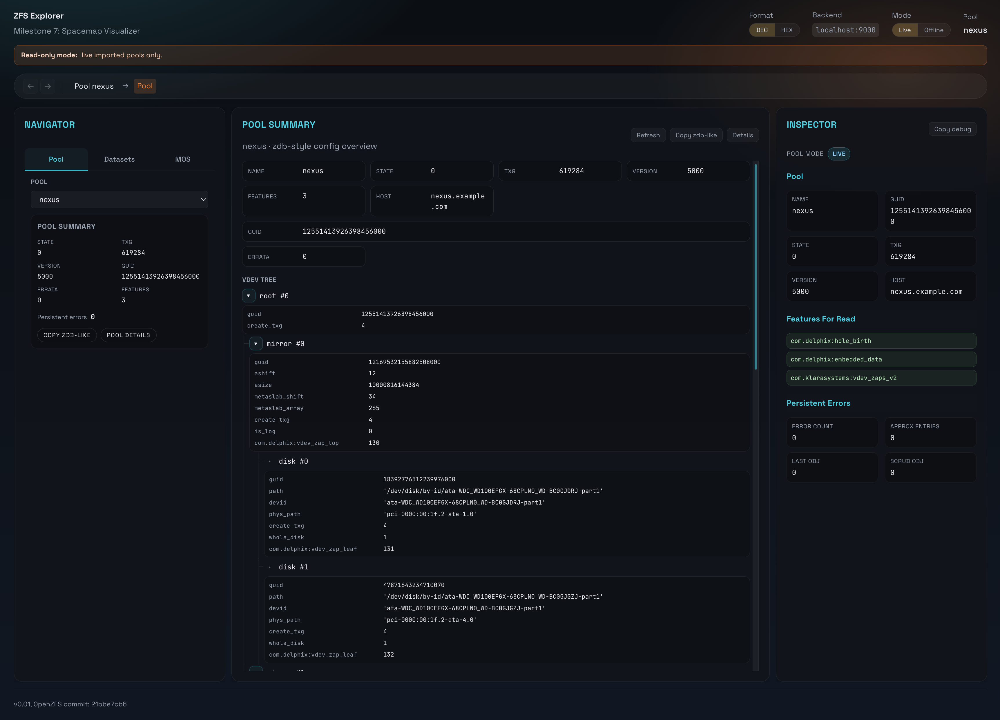
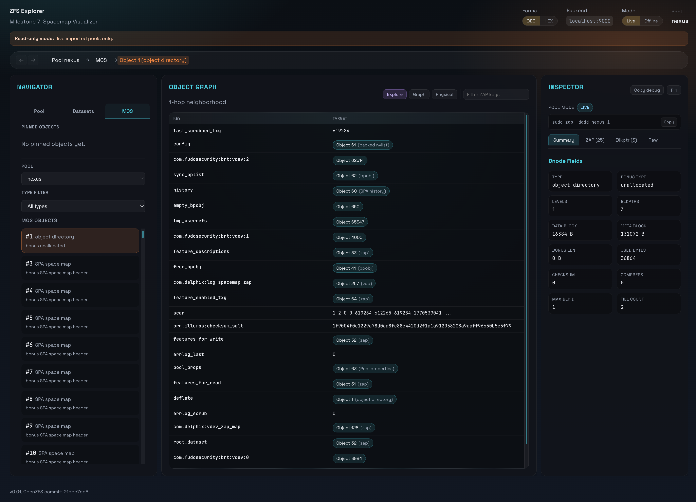
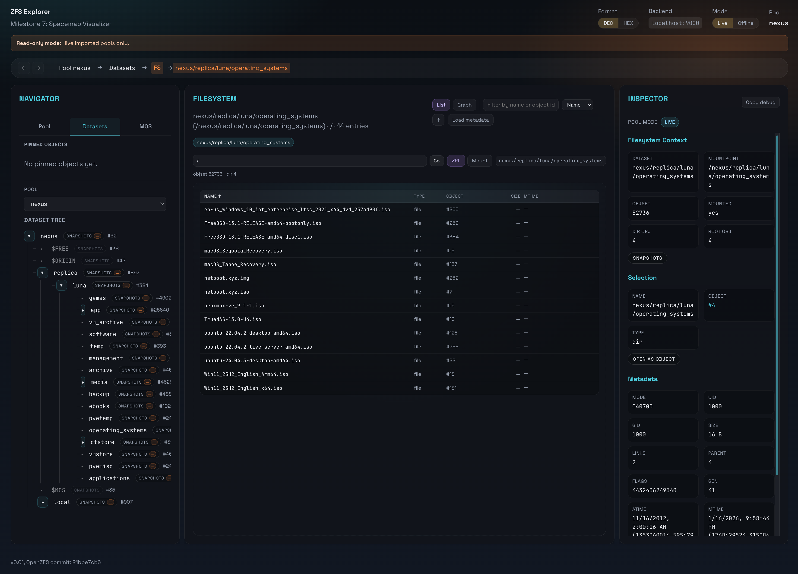
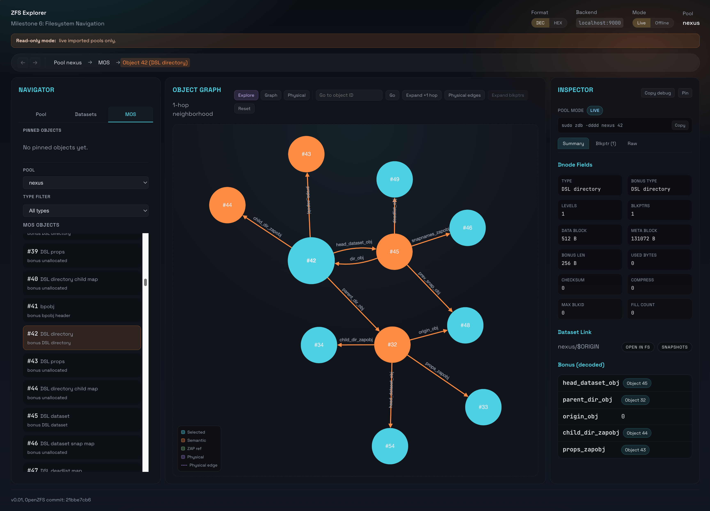
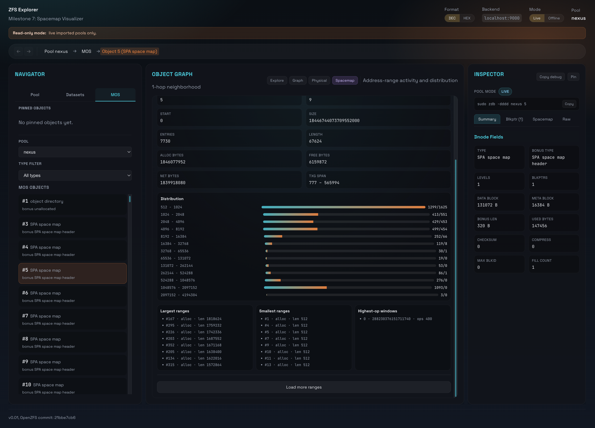

# ZFS Explorer

**ZFS Explorer** is a web-based, read-only explorer for ZFS on-disk structures —
a visual frontend for `zdb`.

It allows interactive inspection of ZFS internals while preserving full
object-level accuracy. The goal is not to abstract ZFS, but to make its on-disk
format explorable, navigable, and debuggable.

ZFS Explorer currently supports:

- Pool configuration summary (zdb-style fields + vdev tree)
- Persistent pool error-log browsing (paged, with optional path resolution)
- MOS object browsing and inspection
- Dnode and blkptr decoding
- ZAP visualization
- Dataset and DSL graph traversal
- ZPL filesystem walking (directories and files)
- Raw block hex inspection via DVAs

The design is intentionally **read-only**. Long-term goals include supporting
analysis of **unimported or damaged pools**, enabling forensic inspection and
file recovery without ever importing the pool.

Current mode disclaimer: default operation is **live imported pools**.
Offline/exported pool analysis is supported and can be enabled explicitly via
env configuration or `GET/PUT /api/mode` (see **Offline Mode** below).

You can think of this project as:

- **`zdb`, visualized**
- **A filesystem browser that never lies**
- **A teaching and debugging tool for ZFS internals**
- **A foundation for ZFS recovery and forensic workflows**

**Current Status:** Active development (Milestones 0-6 complete; Release Readiness + Offline Mode work in progress)

## End-User Quick Start (Prebuilt Releases)

For most users, the recommended path is:

1. Download release artifacts from GitHub Releases:
   - `zfs-explorer-<version-label>-<profile>-<os>-<arch>.tar.gz` (backend)
   - `zfs-explorer-webui-<version-label>.tar.gz` (optional static UI bundle)
2. Run the backend on a host with ZFS access.
3. Use either:
   - the packaged UI bundle (`run-webui.sh`), or
   - your own locally hosted UI that points to tunneled backend port `9000`.

Latest releases:

- https://github.com/mminkus/zfs-explorer/releases/latest

Example backend startup from a release tarball:

```bash
tar -xzf zfs-explorer-<version-label>-release-<os>-<arch>.tar.gz
cd zfs-explorer-<version-label>-release-<os>-<arch>
sudo ./run-backend.sh
```

If you want to build from source or generate custom packages, see
**Developer Guide** below.

## Guided Tour

1. Start backend on the ZFS host (`sudo ./run-backend.sh` or `sudo ./target/debug/zfs-explorer`).
2. Open the UI and pick a pool from the left pane.
3. Use `Datasets` to choose a dataset, then browse its filesystem view.
4. Click `Open as object` (or object links in Inspector) to jump into MOS/object inspection.
5. Use `Explore`, `Graph`, and `Physical` center views to inspect semantic and blkptr relationships.
6. Use Inspector tabs (`Summary`, `ZAP`, `Blkptr`, `Raw`) for detailed decoding and hex reads.
7. Use `Copy debug` in Inspector when reporting bugs.

## Common Workflows

### Dataset -> Filesystem -> Object Inspection

1. Select dataset in `Datasets` tree.
2. Browse paths in FS view (`List` or `Graph`).
3. Select an entry and click `Open as object`.
4. Inspect bonus fields, ZAP links, blkptrs, and raw block hex.

### DSL Traversal Path

1. In MOS mode, open object `1` (object directory) and inspect ZAP entries.
2. Follow `root_dataset` to DSL dir objects.
3. Traverse `child_dir_zapobj` / `head_dataset_obj` edges.
4. Handoff into FS view from dataset-linked inspector actions.

## Screenshots

Screenshots were captured on a high-DPI display. The README shows scaled previews
for readability; click any image to open the full-resolution PNG.

### 1. Pool summary + vdev tree

<a href="docs/screenshots/01-pool-summary.png">
  
</a>

### 2. MOS ZAP map view

<a href="docs/screenshots/02-mos-zap-map.png">
  
</a>

### 3. Dataset tree + filesystem view

<a href="docs/screenshots/03-dataset-tree-fs.png">
  
</a>

### 4. DSL directory graph exploration

<a href="docs/screenshots/04-dsl-directory-graph.png">
  
</a>

### 5. Spacemap visualizer

<a href="docs/screenshots/05-spacemap.png">
  
</a>

## Architecture

ZFS Explorer is a monorepo with layered deliverables:

- `zfs-explorer-ui`: the React web application (typically port `8080`)
- `zdx-api` (internal backend layer): Rust HTTP API service (typically port `9000`)
- `libzdbdecode.so`: native read-only decode layer over vendored OpenZFS userland

Data flow:

```
zfs-explorer-ui -> zdx-api -> libzdbdecode.so -> OpenZFS userland
```

API stability note:

- The API is currently internal-but-documented (`docs/API_REFERENCE.md`).
- Endpoint and payload churn is still expected before a formal stability
  contract (targeting post-v1.0 hardening).

## What's Implemented (Milestones 0-6)

- ✅ Pool discovery/open for imported pools with read-only safety model
- ✅ MOS browser with pagination, filtering, semantic + physical graph views
- ✅ Rich inspector for dnode fields, ZAP, blkptrs, and raw hex block reads
- ✅ Pool summary view with feature list, collapsible vdev tree, and copyable zdb-like output
- ✅ DSL-aware traversal and dataset tree navigation
- ✅ Filesystem navigation (list + graph modes) with dataset/mount handoff
- ✅ SPA history-friendly UI navigation, breadcrumbs, and object pinning
- ✅ Packaging/build scripts and offline fixture + parity validation tooling

## Developer Guide (Build from Source)

This section is for contributors and operators building custom artifacts.
End users should prefer release tarballs from GitHub Releases.

## Bootstrap (Fresh Host)

Use the platform bootstrap script first, then run the normal build.

Debian:

```bash
build/bootstrap-debian.sh
build/build.sh --bootstrap-openzfs
```

Ubuntu:

```bash
build/bootstrap-ubuntu.sh
build/build.sh --bootstrap-openzfs
```

FreeBSD:

```bash
build/bootstrap-freebsd.sh
build/build.sh --bootstrap-openzfs
```

Notes:

- `build/build.sh` uses `gmake` automatically on FreeBSD (or `MAKE` if set).
- On Ubuntu, `zfsutils-linux` is required for corpus fixture create/test scripts.
- If UI build warns about Node version, upgrade to Node `>= 20.19` for Vite 7.

## Running on a Host with ZFS Access

If your UI runs in a container/VM without ZFS access, run the backend on a host
that can see `/dev/zfs`, then tunnel the ports.

If you are an end user, use release tarballs from GitHub Releases instead of
building with `build/package.sh`.

Recommended workflow: package both deliverables once, copy only the backend
tarball to the ZFS host, and run only the backend there. The UI can stay on
your local machine (or another box).

### 1. Build release bundles on your dev machine

```bash
# Produces:
# - dist/zfs-explorer-<version-label>-release-<os>-<arch>.tar.gz
# - dist/zfs-explorer-webui-<version-label>.tar.gz
./build/package.sh --profile release

# Optional: pin an explicit label instead of auto git describe/sha.
# ./build/package.sh --profile release --version-label v1.0.0-rc1
```

### 2. Copy the backend tarball to the ZFS host

```bash
# Adjust OS/arch/USER/HOST to your environment.
OS_NAME="$(uname -s | tr '[:upper:]' '[:lower:]')"
ARCH_NAME="$(uname -m)"
TARBALL="$(ls -1 dist/zfs-explorer-*-release-${OS_NAME}-${ARCH_NAME}.tar.gz | sort | tail -n1)"
scp "$TARBALL" USER@HOST:/tmp/
```

### 3. Unpack and run backend on the ZFS host

```bash
ssh USER@HOST
mkdir -p ~/zfs-explorer
OS_NAME="$(uname -s | tr '[:upper:]' '[:lower:]')"
BACKEND_TAR="$(ls -1 /tmp/zfs-explorer-*-release-${OS_NAME}-$(uname -m).tar.gz | sort | tail -n1)"
tar -xzf "$BACKEND_TAR" -C ~/zfs-explorer --strip-components=1
cd ~/zfs-explorer
sudo ./run-backend.sh
```

Expected output:
```
INFO zfs_explorer: Initializing ZFS library...
INFO zfs_explorer: ZFS Explorer (...)
INFO zfs_explorer: API server listening on 127.0.0.1:9000
```

### 4. Choose UI + tunnel topology

#### A) UI runs on your local machine (common)

```bash
# Terminal 1: local -> ZFS host backend
ssh -L 9000:127.0.0.1:9000 USER_ZFS@ZFS_HOST

# Terminal 2: run UI locally
cd ui
npm run dev
# Open http://127.0.0.1:8080
```

#### B) UI runs on a separate build box, backend runs on ZFS host

```bash
# Terminal 1: local -> build box UI
ssh -L 8080:127.0.0.1:8080 USER_BUILD@BUILD_HOST

# Terminal 2: local -> ZFS host backend
ssh -L 9000:127.0.0.1:9000 USER_ZFS@ZFS_HOST

# Open http://127.0.0.1:8080 on your local machine
```

This works because the UI currently targets `http://localhost:9000`, so your
browser reaches the backend through your local `9000` tunnel.

#### C) Build box and ZFS host are the same machine

```bash
ssh -L 8080:127.0.0.1:8080 -L 9000:127.0.0.1:9000 USER@HOST
# UI on localhost:8080, backend on localhost:9000
```

Tunnel reliability tip:

- Keep long-lived tunnel sessions in `tmux` or `screen` so they survive local
  terminal disconnects/restarts.

## Offline Mode

Backend startup now supports an explicit offline pool-open mode for exported
pools. This mode is opt-in and remains read-only.

Runtime switching is also available from the UI header (`Mode: Live | Offline`)
or directly via `GET/PUT /api/mode`.

```bash
export ZFS_EXPLORER_POOL_MODE=offline
export ZFS_EXPLORER_OFFLINE_POOLS="poolA,poolB"
export ZFS_EXPLORER_OFFLINE_PATHS="/dev/disk/by-id:/srv/offline-images"
sudo ./run-backend.sh
```

Environment variables:

- `ZFS_EXPLORER_POOL_MODE`: `live` (default) or `offline`
- `ZFS_EXPLORER_OFFLINE_POOLS`: comma-separated pool names exposed by `/api/pools` in offline mode
- `ZFS_EXPLORER_OFFLINE_PATHS`: colon-separated search paths used by offline open logic
- `ZFS_EXPLORER_ZPOOL_CACHEFILE`: optional override for pool cachefile path in live mode
  (useful on hosts that do not use `/etc/zfs/zpool.cache`, e.g. `/data/zfs/zpool.cache`)

Offline troubleshooting:

- API errors now return a structured envelope:
  - `code` (for example `EZFS_NOENT`, `ERRNO_13`)
  - `message`
  - optional `hint`
- Typical fixes:
  - `EZFS_NOENT`: pool metadata was not found in the configured search paths
  - `EZFS_PERM` / `ERRNO_13`: backend needs root/raw-device read access
  - `EZFS_ACTIVE_POOL`: export pool before opening in offline mode

Direct file recovery download (live or offline):

```bash
# Download by dataset path (or absolute mounted path), with attachment headers
curl -fL -o recovered.bin \
  "http://127.0.0.1:9000/api/pools/testpool/zpl/path/testpool/myds/path/file.bin"

# Resume a partial transfer via HTTP Range
curl -fL -C - -o recovered.bin \
  "http://127.0.0.1:9000/api/pools/testpool/zpl/path/testpool/myds/path/file.bin"

# Explicit single-range request
curl -fL \
  -H "Range: bytes=0-1048575" \
  "http://127.0.0.1:9000/api/pools/testpool/zpl/path/testpool/myds/path/file.bin" \
  -o chunk-0.bin

# Objset-scoped download (works for dataset heads and snapshots)
curl -fL -o recovered.bin \
  "http://127.0.0.1:9000/api/pools/testpool/objset/72/zpl/path/data/docs/readme.txt"
```

Recursive dataset/snapshot recovery (CLI-first):

```bash
# Recover an entire dataset subtree
python tools/recover-files.py \
  --backend http://127.0.0.1:9000 \
  --filesystem zpool/data \
  --path /docs \
  --destination /tmp/recovered-docs

# Recover from a snapshot
python tools/recover-files.py \
  --backend http://127.0.0.1:9000 \
  --filesystem zpool/data@snap-2026-02-20 \
  --destination /tmp/recovered-snapshot

# Force streaming ZPL download for dataset heads
python tools/recover-files.py \
  --backend http://127.0.0.1:9000 \
  --filesystem zpool/data \
  --destination /tmp/recovered \
  --download-method zpl

# Auto-start backend if needed (operator-supplied command)
python tools/recover-files.py \
  --backend http://127.0.0.1:9000 \
  --filesystem zpool/data \
  --destination /tmp/recovered \
  --start-backend-if-needed \
  --start-backend-cmd "sudo ./run-backend.sh"
```

By default, the tool writes:
- per-file NDJSON manifest: `<destination>/recover-manifest.ndjson`
- run summary JSON: `<destination>/recover-summary.json`
- `<file>.FAILED.json` sidecars for files that could not be recovered

Optional parity check workflow (live vs offline responses):

```bash
# live backend on :9000, offline backend on :9001
LIVE_BASE_URL=http://127.0.0.1:9000 \
OFFLINE_BASE_URL=http://127.0.0.1:9001 \
build/check-offline-parity.sh <pool> 1 32 34
```

Create a local offline fixture pool and run offline smoke checks:

```bash
# create/export a small file-backed fixture pool
build/create-offline-fixture.sh --pool zdx_fixture --force

# run backend smoke checks against that fixture (root required)
sudo build/test-offline-fixture.sh \
  --pool zdx_fixture \
  --search-paths "$(pwd)/fixtures/offline/zdx_fixture"
```

Create and validate corpus fixtures (layout/profile matrix):

```bash
# generate exported corpus fixture
build/create-corpus-fixture.sh \
  --pool zdx_mirror_base \
  --layout mirror \
  --profile baseline \
  --force

# generate encrypted dataset fixture (no key material available offline)
build/create-corpus-fixture.sh \
  --pool zdx_enc_nokey \
  --layout single \
  --profile encryption-no-key \
  --force

# run smoke checks + file checksum validation from manifest
sudo build/test-corpus-fixture.sh \
  --manifest fixtures/corpus/vdevtype=mirror/features=baseline/zdx_mirror_base/manifest.json

# run the default minimal corpus subset (mirror + raidz1 + encryption-no-key)
sudo build/test-corpus-subset.sh --list
sudo build/test-corpus-subset.sh

# create the full layout/profile matrix (54 combinations by default)
build/create-corpus-matrix.sh --list
build/create-corpus-matrix.sh --force

# validate every discovered manifest in the selected matrix
sudo build/test-corpus-matrix.sh --list
sudo build/test-corpus-matrix.sh --keep-going
```

Quick API sanity checks (backend runs on `127.0.0.1:9000`):

```bash
curl -s http://127.0.0.1:9000/api/pools | jq
curl -s http://127.0.0.1:9000/api/pools/<pool>/summary | jq
```

Run a focused OpenZFS ZTS smoke set (non-root user with passwordless sudo):

```bash
# list default "corpus" smoke tests
build/run-zts-smoke.sh --list

# run corpus profile smoke checks using sparse file-vdevs
build/run-zts-smoke.sh --profile corpus

# continue after failures and include extra zfs-tests.sh args
build/run-zts-smoke.sh --profile extended --keep-going -- -v
```

## Project Structure

```
zfs-explorer/
├── zfs/                    # OpenZFS submodule (commit 21bbe7cb6)
├── _deps/openzfs/          # Built OpenZFS userland
├── native/                 # C wrapper (libzdbdecode)
│   ├── include/
│   │   └── zdbdecode.h    # Public API
│   ├── src/
│   │   ├── zdbdecode_internal.h
│   │   ├── zdx_core.c
│   │   ├── zdx_pool.c
│   │   ├── zdx_mos.c
│   │   ├── zdx_dsl.c
│   │   ├── zdx_objset.c
│   │   ├── zdx_catalog.c
│   │   ├── zdx_zap.c
│   │   ├── zdx_block.c
│   │   ├── json.c         # JSON helpers
│   │   └── json.h
│   ├── libzdbdecode.so    # Built library
│   └── Makefile
├── backend/                # Rust server
│   ├── Cargo.toml
│   ├── build.rs           # FFI bindings
│   └── src/
│       ├── main.rs        # Entry point
│       ├── ffi/           # Safe FFI wrappers
│       └── api/           # API handlers
└── ui/                     # React frontend
    ├── package.json
    └── src/
        ├── App.tsx        # Main component
        └── App.css
```

## API Endpoints

Full endpoint reference (all registered routes, params, and notes):

- `docs/API_REFERENCE.md`

Commonly used endpoints:

- `GET /api/version` - Build/runtime/debug metadata (includes active pool-open mode)
- `GET /api/pools` - List pools visible in current mode
- `GET /api/pools/{pool}/summary` - Structured pool config summary
- `GET /api/pools/{pool}/datasets/tree` - Dataset hierarchy for a pool
- `GET /api/pools/{pool}/objset/{objset_id}/walk?path=/a/b` - Path walk within objset
- `GET /api/pools/{pool}/zpl/path/{*zpl_path}` - File download by ZPL path (single `Range` supported)

## Build from Scratch

### 0. Clone with submodules

`zfs/` is an OpenZFS git submodule and is required for native/backend builds.
For the current 1.0 RC line, the repo pins an OpenZFS compatibility commit used
to tolerate older distro kernel modules, including older Ubuntu ZFS module
packages. That commit currently lives in the `mminkus/zfs` fork, so the
submodule URL points there to keep fresh clones reproducible.

```bash
# fresh clone
git clone --recurse-submodules https://github.com/mminkus/zfs-explorer.git
cd zfs-explorer

# if you already cloned without submodules
git submodule update --init --recursive
```

If you switch OpenZFS branches/tags in `zfs/` (for example `zfs-2.4.0` vs
`master`), do a clean re-sync before rebuilding to avoid mixed generated files.

```bash
git submodule update --init --recursive --force
git -C zfs reset --hard
git -C zfs clean -fdx
git -C zfs sparse-checkout disable || true
```

Local `build/build.sh` runs this check in warning mode by default so maintainers
can experiment with OpenZFS rebases. Packaging/release scripts still fail fast
unless `--allow-openzfs-drift` is passed explicitly. If you want to restore the
pinned compat baseline, run:

```bash
git submodule update --init --recursive
```

### 1. Install prerequisites (Debian/Ubuntu)

Quick bootstrap (recommended on fresh Debian VMs):

```bash
./build/bootstrap-debian.sh
```

This installs apt dependencies, host OpenZFS runtime packages, and initializes
submodules. Then continue with `./build/build.sh --bootstrap-openzfs`.

Manual install:

```bash
sudo apt-get update
sudo apt-get install -y \
  git build-essential autoconf automake libtool pkg-config m4 gawk \
  libssl-dev libelf-dev libudev-dev libblkid-dev uuid-dev zlib1g-dev \
  libzstd-dev libtirpc-dev clang libclang-dev \
  python3 python3-pip python3-setuptools python3-cffi libffi-dev \
  nodejs npm curl jq
```

Install Rust (if `cargo` is missing):

```bash
curl https://sh.rustup.rs -sSf | sh
source "$HOME/.cargo/env"
```

Node 20+ is recommended for current Vite/TypeScript tooling.

Backend note: Rust `bindgen` requires `libclang` at build time. If you see
`Unable to find libclang`, ensure `clang` and `libclang-dev` are installed.

### 1.1 Install OpenZFS runtime packages on Debian (recommended: backports)

For live pool access (`/dev/zfs`) and CLI-backed telemetry (`zpool`, `zfs`),
install Debian OpenZFS packages from backports.

```bash
# enable backports (adjust if your host manages apt sources differently)
echo "deb http://deb.debian.org/debian $(. /etc/os-release; echo $VERSION_CODENAME)-backports main contrib" \
  | sudo tee /etc/apt/sources.list.d/backports.list

sudo apt-get update
sudo apt-get install -y -t "$( . /etc/os-release; echo $VERSION_CODENAME)-backports" \
  zfsutils-linux zfs-dkms zfs-zed

# optional test tooling
sudo apt-get install -y -t "$( . /etc/os-release; echo $VERSION_CODENAME)-backports" zfs-test

# optional: required for build/run-zts-smoke.sh (ZTS uses ksh tests)
sudo apt-get install -y ksh
```

Notes:
- This project builds against the vendored `zfs/` submodule, not distro
  OpenZFS headers/libs.
- The currently pinned `zfs/` commit carries the compatibility baseline we use
  for older distro kernel modules. Release builds should use the pinned
  submodule state, not an arbitrary local `zfs/` branch. Local builds warn on
  drift by default; package/release scripts stay strict unless explicitly run
  with `--allow-openzfs-drift`.
- The submodule points at `mminkus/zfs` because the pinned compatibility commit
  is not part of upstream `openzfs/zfs`. Maintainers working on rebases can add
  an `upstream` remote inside `zfs/` as needed.
- Host OpenZFS packages are still needed to access imported pools in live mode.
- After `zfs-dkms` install/upgrade, a reboot or `modprobe zfs` may be required.
- Debian backports currently tracks OpenZFS 2.4.0. If you want strict
  parity testing against those host packages, you can temporarily check out
  `zfs-2.4.0` in the `zfs/` submodule for local builds:
  `git -C zfs checkout zfs-2.4.0`
  and switch back to the repo-pinned baseline with:
  `git submodule update --init --recursive`.

### 2. Build

Canonical build entrypoint:

```bash
# Full build (native + backend + UI build)
./build/build.sh
```

Fast local rebuild loop:

```bash
# Equivalent to: native clean+make, backend build+unit tests,
# native unit tests, UI build
./build/build.sh --quick
```

Quick local unit-test loop:

```bash
# backend unit tests + native unit tests + optional UI build
./build/test-quick.sh

# skip UI build when iterating backend/native only
./build/test-quick.sh --skip-ui-build
```

Testing policy and scope split (unit vs fixture) are documented in
`docs/TESTING_STRATEGY.md`.

If you need to bootstrap vendored OpenZFS userland as well:

```bash
./build/build.sh --bootstrap-openzfs
```

Manual equivalent (reference):

```bash
# 1. Build OpenZFS userland (one time)
cd zfs
./autogen.sh
./configure --prefix=$PWD/../_deps/openzfs --with-config=user --enable-debug
make -j$(nproc)
make install
cd ..

# 2. Build native library
cd native
make clean && make
cd ..

# 3. Build Rust backend (with baked-in rpath)
cd backend
source ~/.cargo/env
cargo build
cd ..
# The binary will have rpath set via .cargo/config.toml
# This means it can find its libraries without LD_LIBRARY_PATH

# 4. Install UI dependencies
cd ui
npm install
```

### Build Troubleshooting (OpenZFS submodule state)

If OpenZFS fails with errors like:

- `No rule to make target 'libuutil.h', needed by 'all-am'`
- missing header mismatches after switching `zfs/` commits

the issue is usually a stale/mixed OpenZFS source tree state, not a missing
system package. Reset and rebuild from a clean `zfs/` tree:

```bash
git submodule update --init --recursive --force
git -C zfs reset --hard
git -C zfs clean -fdx
git -C zfs sparse-checkout disable || true

# Optional: choose a specific OpenZFS ref for parity testing
# git -C zfs checkout zfs-2.4.0

cd zfs
./autogen.sh
./configure --prefix="$PWD/../_deps/openzfs" --with-config=user --enable-debug
make -j"$(nproc)"
make install
```

## Packaging for Remote Hosts

Build two bundles:

- zdx-api backend bundle (binary + required shared libraries)
- web UI static bundle

```bash
# debug bundle
./build/package.sh

# release bundle
./build/package.sh --profile release

# package existing artifacts without rebuilding
./build/package.sh --skip-build
```

Output:

- Backend directory: `dist/zfs-explorer-<version-label>-<profile>-<os>-<arch>/`
- Backend tarball: `dist/zfs-explorer-<version-label>-<profile>-<os>-<arch>.tar.gz`
- Web UI directory: `dist/zfs-explorer-webui-<version-label>/`
- Web UI tarball: `dist/zfs-explorer-webui-<version-label>.tar.gz`

Run the packaged web UI bundle with:

```bash
WEBUI_TAR="$(ls -1 dist/zfs-explorer-webui-*.tar.gz | sort | tail -n1)"
tar -xzf "$WEBUI_TAR" -C /tmp
cd /tmp/"$(basename "$WEBUI_TAR" .tar.gz)"
./run-webui.sh 8080
```

Run backend from the bundle with:

```bash
./run-backend.sh
```

If your host requires elevated privileges to access pools, run:

```bash
sudo ./run-backend.sh
```

Typical remote-host flow:

```bash
# on build machine
./build/package.sh --profile release
OS_NAME="$(uname -s | tr '[:upper:]' '[:lower:]')"
BACKEND_TAR="$(ls -1 dist/zfs-explorer-*-release-${OS_NAME}-$(uname -m).tar.gz | sort | tail -n1)"
rsync -av "$BACKEND_TAR" USER@HOST:/tmp/

# on target host
cd /opt
OS_NAME="$(uname -s | tr '[:upper:]' '[:lower:]')"
BACKEND_TAR="$(ls -1 /tmp/zfs-explorer-*-release-${OS_NAME}-$(uname -m).tar.gz | sort | tail -n1)"
sudo tar -xzf "$BACKEND_TAR"
cd "$(basename "$BACKEND_TAR" .tar.gz)"
sudo ./run-backend.sh
```

### Package Matrix Automation (Docker + FreeBSD SSH)

Use `build/package-matrix.sh` to produce release artifacts for multiple
platforms in one run:

- Linux targets built in Docker:
  `debian12`, `debian13`, `ubuntu2204`, `ubuntu2404`, `ubuntu2504`,
  `rocky9`, `alma10`
- FreeBSD target built via SSH on a remote host

```bash
# Default matrix:
# - Linux: debian12, debian13, ubuntu2204, ubuntu2404, ubuntu2504, rocky9, alma10
# - FreeBSD: skipped by default
./build/package-matrix.sh

# Linux + FreeBSD
./build/package-matrix.sh --freebsd-host freebsd.example.net

# FreeBSD only (explicit host required)
./build/package-matrix.sh --skip-linux --freebsd-host freebsd.example.net
```

Outputs are written under `dist/releases/<utc-timestamp>/` and include:

- distro-labeled backend tarballs under `linux/` and `freebsd/`
- shared `zfs-explorer-webui-<version-label>.tar.gz`
- `SHA256SUMS.txt` for generated tarballs
- `MATRIX_SUMMARY.txt` (run metadata + pass/fail summary)
- `matrix-logs-<utc-timestamp>.tar.gz` (archived logs for support triage)

Notes:

- Linux matrix requires Docker on the host.
- FreeBSD matrix is opt-in and requires `--freebsd-host`, passwordless
  SSH/scp access, and the repo checked out at the same path
  (or pass `--freebsd-repo`).
- Linux matrix builds the UI once locally unless `--skip-ui-build` is used.
- Default version label is derived from git (`describe --tags --dirty --always`);
  override with `--version-label <label>` for release candidates.

### 1.0 Supported Platform Policy

For the 1.0 announcement, we publish and smoke-test release tarballs for:

- Debian 13
- Ubuntu 24.04
- FreeBSD 15
- AlmaLinux 10 (EL10 family)

Additional matrix targets (Debian 12, Ubuntu 22.04/25.04, EL9) are validated
regularly but are considered compatibility coverage, not primary release gates.

### Release Playbook

Maintainer release steps (build, verify, publish, and log archival) are
documented in:

- `docs/RELEASE_PLAYBOOK.md`

Note: full static backend linking is not the primary target right now.
See `docs/PACKAGING_STATIC_FEASIBILITY.md` for the current packaging decision.

## Security Model

- Backend binds to **127.0.0.1:9000** only (localhost)
- Access via SSH tunnel for remote use
- Requires root privileges (or ZFS capabilities) to access pools

## Read-Only Safety Model

- Native initialization uses `kernel_init(SPA_MODE_READ)`.
- Live mode opens already-imported pools and does not issue write paths.
- Offline mode is explicit and uses read-only import plumbing for analysis.
- Native runtime guardrails reject pool access if read-only mode is not active.
- API bind address is localhost-only by default (`127.0.0.1:9000`).
- Offline/exported mode is supported and can be selected via env vars or
  `GET/PUT /api/mode`.

This project is intended for inspection and debugging, not mutation.

## Screenshot Mode

For demos/recordings, a UI screenshot mode can anonymize selected sensitive
JSON fields (hostname, GUIDs, hostid, and device path identifiers) while
preserving object relationships.

See:

- `docs/SCREENSHOT_MODE.md`

## Known Limitations

Known caveats and expected failure modes are tracked in:

- `docs/KNOWN_LIMITATIONS.md`

## FreeBSD Notes

FreeBSD development and validation notes:

- `docs/PORTABILITY_FREEBSD.md`

## Logging and Debug Info

Backend logging uses `tracing` with `INFO` as default if `RUST_LOG` is unset.

Common `RUST_LOG` presets:

```bash
# Default behavior (same as unset)
RUST_LOG=info sudo ./target/debug/zfs-explorer

# Quieter operation
RUST_LOG=warn sudo ./target/debug/zfs-explorer

# Debug ZFS Explorer backend routes and FFI flow
RUST_LOG=zfs_explorer=debug,axum=info,tower_http=info sudo ./target/debug/zfs-explorer
```

Debug metadata endpoint:

```bash
curl http://127.0.0.1:9000/api/version
```

The Inspector also provides a `Copy debug` action that copies backend version/runtime info plus current UI navigation context as JSON.

## Validation Checklist

For repeatable milestone/release verification, use:

- `docs/VALIDATION_CHECKLIST.md`
- `docs/TESTING_STRATEGY.md`
- `docs/SCREENSHOTS.md`

## Next Steps

- Finish FS navigation + graph integration
- Add richer ZPL metadata decoding
- Expand graph tools and inspection workflows

## Tech Stack

| Component | Technology |
|-----------|------------|
| Native | C + ZFS libraries |
| Backend | Rust + axum |
| Frontend | React 19 + TypeScript + Vite |

## References

- OpenZFS commit: [21bbe7cb6](https://github.com/openzfs/zfs/commit/21bbe7cb6)
- Additional background resources: `docs/RESOURCES.md`
- ZFS on disk format for modern day OpenZFS:
  [mminkus/zfs-ondiskformat](https://github.com/mminkus/zfs-ondiskformat/)
- Understanding the OpenZFS Codebase: A Guided Walkthrough for Engineers:
  [mminkus/zfs-codebase](https://github.com/mminkus/zfs-codebase/)
